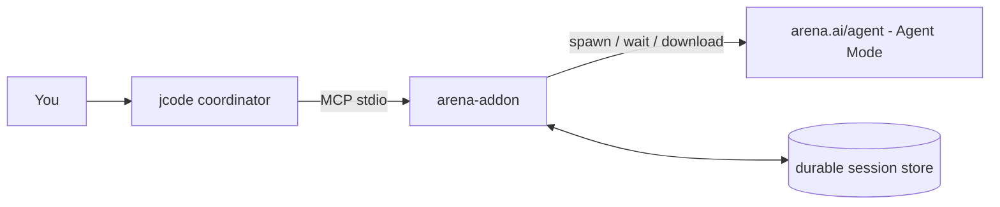

# arena-addon for jcode

An MCP addon that lets **jcode** use **arena.ai's Agent Mode** as sub-agents.

jcode's own agent can `arena_spawn` a task, `arena_wait` for the Arena agent to
finish, and `arena_download_workspace` its files. The result is reported back
into jcode's swarm/coordinator flow, so an Arena agent behaves like an
autonomous sub-agent of jcode.



---

## Why a driver?

arena.ai's Agent Mode is an authenticated web app with **no public API**. So the
addon ships two interchangeable drivers behind one MCP interface:

| Driver | What it does | Needs |
|--------|--------------|-------|
| `mock` (default) | Simulates a full agent run and produces a workspace, with no browser. | nothing |
| `cdp` | Drives a real, already-logged-in browser (Chrome/Chromium over CDP) that is open on arena.ai, submits tasks to Agent Mode, and reads back the output. | `playwright`, a running browser |

Use `mock` to exercise the contract end to end, then switch to `cdp` for real
Arena agents.

---

## Quick start (mock, no browser)

```bash
cd arena-addon
python3 -m arena_addon --driver mock          # serves MCP over stdio
```

Register it with jcode:

```bash
./register.sh            # writes {"mcpServers": {"arena": ...}} into ~/.jcode/mcp.json
```

Restart jcode (or reload its MCP servers). Then tell jcode something like:

> Use the arena sub-agent: spawn "build a landing page", wait for it, and give
> me a one-paragraph summary of what it produced.

jcode will call `arena_spawn` → `arena_wait` → (optionally)
`arena_download_workspace`.

---

## Real Arena agents (cdp driver)

1. Install Playwright and make sure `python3 -m arena_addon` is importable
   (it lives in this repo, so either run jcode from here, add the repo to
   `PYTHONPATH`, or `python3 -m pip install -e .`).

   ```bash
   python3 -m pip install 'playwright'
   # optional, if you don't already have a browser to attach to:
   python3 -m playwright install chromium
   ```

2. Start a browser that is **logged in to arena.ai** with remote debugging:

   ```bash
   chromium --remote-debugging-port=9222 --user-data-dir="$HOME/.arena-browser"
   # log in to arena.ai in that window (once), then leave it running
   ```

3. Register with the cdp driver:

   ```bash
   ARENA_DRIVER=cdp ./register.sh
   ```

The addon attaches to `http://127.0.0.1:9222` (override with `ARENA_CDP_URL`),
reuses your authenticated session, opens `/agent` (override with
`ARENA_AGENT_URL`), types the task, sends it, and polls until the agent
finishes.

---

## MCP tools

| Tool | Description |
|------|-------------|
| `arena_spawn` | Kick off an Arena Agent Mode run. Returns a `session_id`. Accepts `task` and optional `upload_files`. |
| `arena_status` | Poll progress for a `session_id` (`pending`/`running`/`completed`/`failed`/`blocked_request`…). |
| `arena_wait` | Block until completion or `timeout_secs`; returns the final result. |
| `arena_list` | List spawned sessions and their statuses. |
| `arena_download_workspace` | Write the Arena agent's workspace files into `dest_dir`. |

State is persisted to `~/.jcode/arena-addon/sessions.json` (override with
`ARENA_ADDON_DIR`), so in-flight work survives jcode MCP server reloads.

---

## Configuration

All knobs are environment variables or CLI flags.

| Env var | Meaning | Default |
|---------|---------|---------|
| `ARENA_DRIVER` | `mock` or `cdp` | `mock` |
| `ARENA_CDP_URL` | CDP endpoint of your logged-in browser | `http://127.0.0.1:9222` |
| `ARENA_AGENT_URL` | Agent Mode URL | `https://arena.ai/agent` |
| `ARENA_POLL_INTERVAL` | poll cadence (cdp) | `2` s |
| `ARENA_IDLE_LOOPS` | satisfied samples before declaring done (cdp) | `4` |
| `ARENA_HARD_TIMEOUT` | hard cap per run (cdp) | `3600` s |
| `ARENA_DRY_RUN` | fill but don't send (cdp, for selector tuning) | `0` |
| `ARENA_ADDON_DIR` | directory for the durable session store | `~/.jcode/arena-addon` |
| `ARENA_MOCK_WORK_SECONDS` | how long the mock agent "works" | `3` |
| `ARENA_MOCK_DELAY_SECONDS` | mock start delay | `1` |

CLI flags: `--driver`, `--mock-work-seconds`, `--mock-delay-seconds`,
`--store`, `--poll-interval`.

---

## Limitations & tuning

- **arena.ai is a JS SPA.** DOM selectors for the input box and send button are
  centralized at the top of `arena_addon/drivers/cdp.py`
  (`CANDIDATE_INPUTS`, `CANDIDATE_SEND`) and are best-effort. If the UI changes,
  tune those lists. Use `ARENA_DRY_RUN=1` to verify the addon finds the input
  without submitting.
- **Login / Cloudflare.** You must be logged in to arena.ai in the attached
  browser. A captcha/challenge may need to be solved manually once in that
  window.
- **Clarifying questions.** If the Arena agent pauses to ask something, the
  driver reports `blocked_request`. Respond by posting a follow-up in the same
  browser window (a guided `/respond` tool is a future enhancement).
- **Workspace download.** Arena keeps files in the session workspace. The `cdp`
  driver's workspace download needs the browser to hit the
  `/download-workspace` flow; the `mock` driver always produces sample files.
- This project is MIT licensed and independent of arena.ai; verify against
  arena.ai's terms when automating their site.

---

## Ref / install

```bash
./register.sh                # register with jcode
python3 -m pip install -e .  # optional, to make `arena_addon` importable everywhere
```

## Tests

```bash
python3 -m unittest discover -s tests -v
```